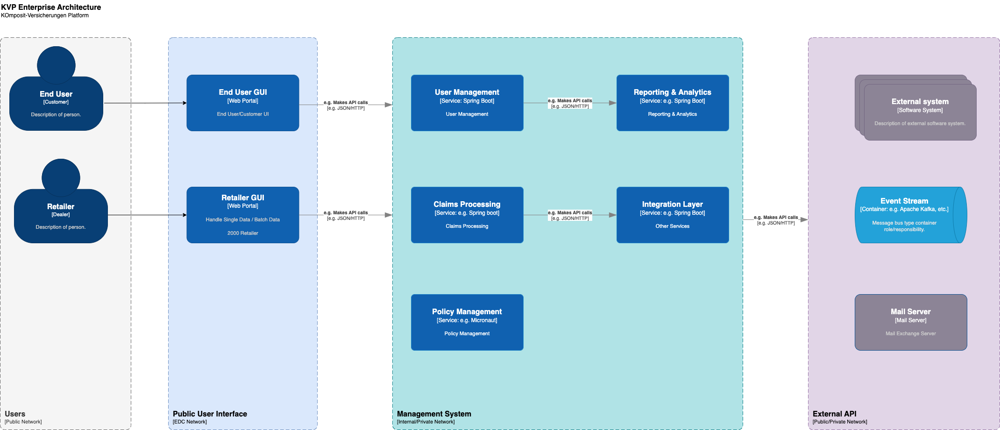
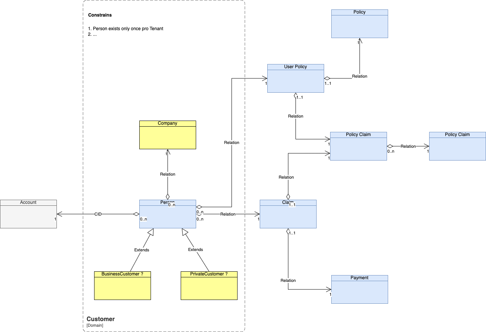
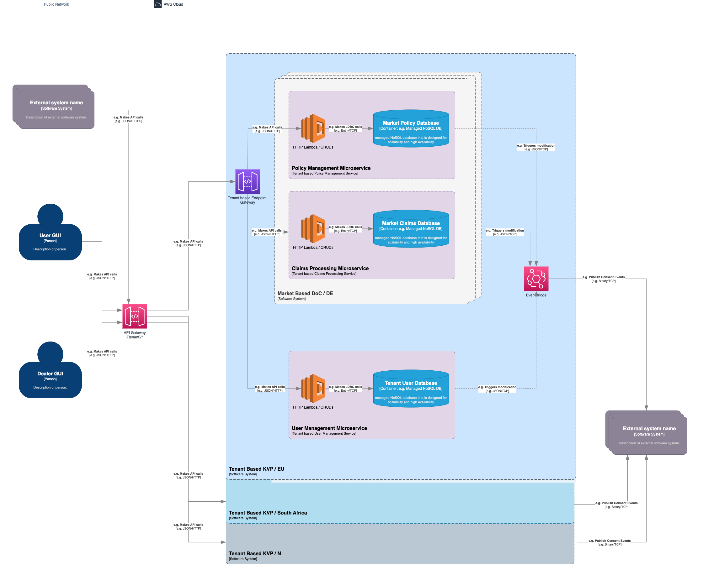
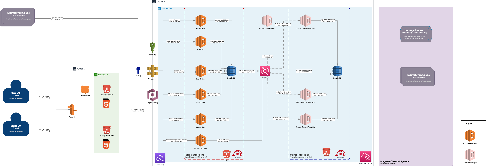
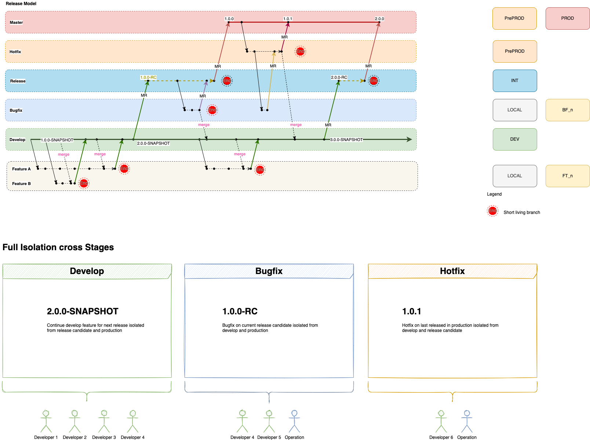
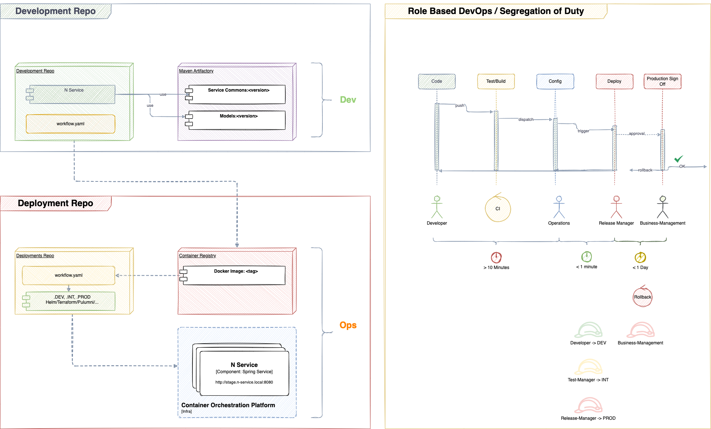
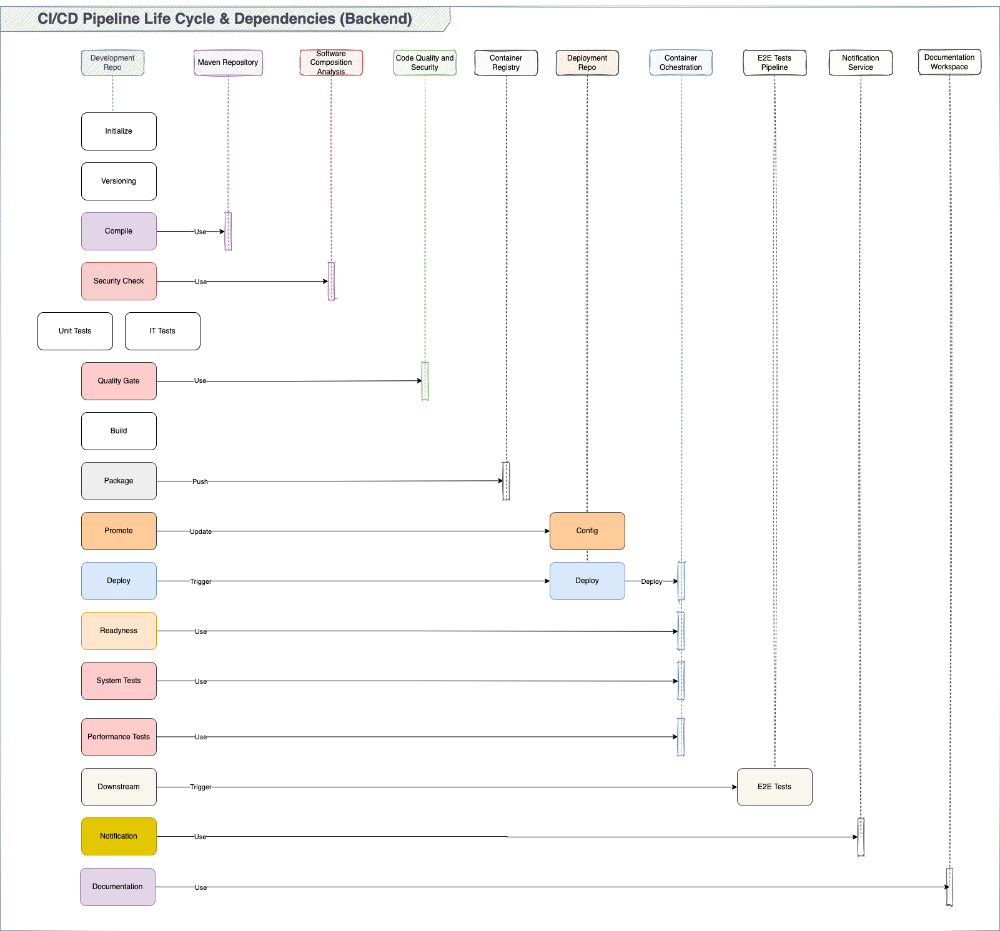
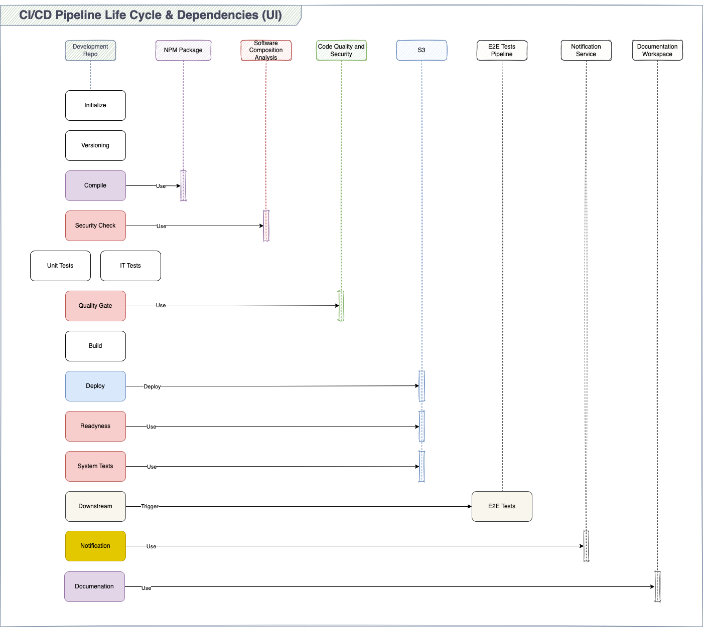
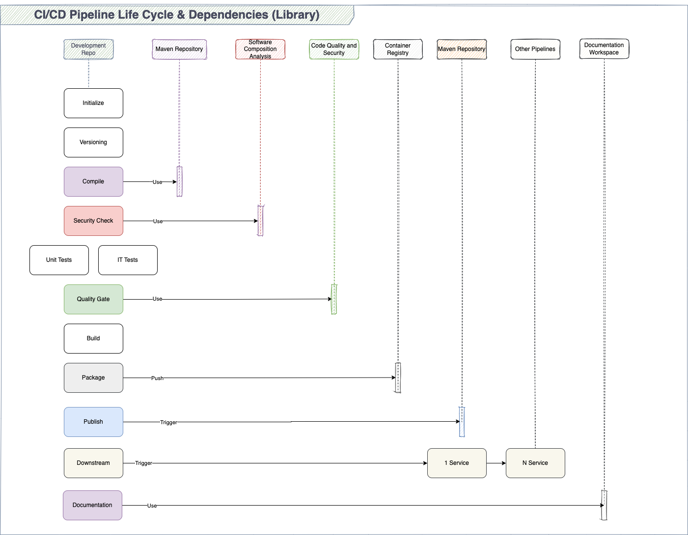

# Plattform für Komposit-Versicherungen

## 1. Einführung und Ziele
### 1.1 Einleitung
Diese Dokumentation beschreibt die Softwarearchitektur der Plattform für Komposit-Versicherungen. Ziel ist es, eine klare und verständliche Struktur der Architektur darzustellen, um sowohl aktuelle Anforderungen als auch zukünftige Entwicklungen zu unterstützen.

### 1.2 Ziele
- Bereitstellung einer skalierbaren, flexiblen und hochverfügbaren Plattform
- Sicherstellung der Integrität und Sicherheit der Daten
- Unterstützung agiler Entwicklungsprozesse und kontinuierlicher Integration
- Einhaltung von Compliance- und Regulierungsanforderungen

## 1.4 Stakeholder

| Name         | Rolle                | Kontakt          | Erwartungen                       |
|--------------|----------------------|------------------|-----------------------------------|
| Mario Tema   | Enterprise Architect | microtema@web.de | Architektur-Design und -Bewertung |
| Julius Cesar | Solution Architect   | julius@cesar.de  | Lösungsdesign und Implementierung |
| Marco Polo   | Projekt Manager      | marcpo@polo.de   | ...                               |
| ---          | ---                  | ---              | ---                               |

## 2. Randbedingungen
### 2.1 Technische Randbedingungen
- Einsatz von Cloud-native Technologien (z.B. Kubernetes, Docker)
- Verwendung von Microservices-Architektur
- Integration von Event-Driven Architekturen (z.B. Apache Kafka)

### 2.2 Organisatorische Randbedingungen
- Agile Entwicklungsmethoden (SCRUM, Kanban)
- Enge Zusammenarbeit zwischen DevOps-Teams und Architekten
- Einhaltung von branchenspezifischen Regulierungen

## 3. Kontextabgrenzung

### Business Model

### 3.1 Business-Kontext
- Integration mit Versicherungsmaklern, Kundenportalen und internen Systemen
- Bereitstellung von APIs für externe Partner

### 3.2 Technischer Kontext
- Integration von internen und externen Systemen über RESTful APIs und gRPC
- Nutzung von Message Queues und Event Streams zur asynchronen Kommunikation

## 4. Lösungstrategie
- Verwendung von Microservices zur Modularisierung
- Einsatz von Kubernetes für die Container-Orchestrierung
- Nutzung von Kafka für Event-Driven Architekturen
- Implementierung von CI/CD-Pipelines für automatisierte Tests und Bereitstellungen

## 5. Bausteinsicht

### 5.1 Überblick
- Frontend: Angular-basierte Webanwendung
- Backend: Microservices mit Spring Boot und Kotlin
- Datenbanken: PostgreSQL, MongoDB

### 5.2 Hauptbausteine
- User Management
- Policy Management
- Claims Processing
- Reporting and Analytics
- Integration Layer

## 6. Laufzeitsicht
- Detaildarstellung der Kommunikation zwischen den Microservices
- Ablaufdiagramme für typische Geschäftsprozesse (z.B. Erstellung einer Versicherungspolice, Schadenmeldung)

## 7. Verteilungssicht
- Verteilung der Microservices über verschiedene Kubernetes-Cluster
- Netzwerkdiagramme zur Darstellung der Kommunikation zwischen den Clustern und externen Systemen

### Branching Model

### Multi Repo

### Backend Deployment

### Frontend Deployment

### Library Deployment

## 8. Querschnittliche Konzepte
### 8.1 Sicherheitskonzepte
- Implementierung von Authentifizierungs- und Autorisierungsmechanismen (z.B. OAuth2)
- Verschlüsselung sensibler Daten

### 8.2 Logging und Monitoring
- Einsatz von ELK-Stack (Elasticsearch, Logstash, Kibana) für Logging
- Nutzung von Prometheus und Grafana für Monitoring

### 8.3 Fehlerbehandlung und Resilienz
- Implementierung von Circuit Breaker Patterns
- Nutzung von Retry-Mechanismen

## 9. Architekturentscheidungen
- Wahl der Microservices-Architektur zur Verbesserung der Skalierbarkeit und Wartbarkeit
- Entscheidung für Kubernetes als Container-Orchestrierungstool
- Auswahl von Kafka für die Event-Driven Architektur

## 10. Qualitätsanforderungen
### 10.1 Performance
- Skalierbare Architekturen zur Bewältigung hoher Lastspitzen

### 10.2 Sicherheit
- Hohe Standards für Datensicherheit und Datenschutz

### 10.3 Verfügbarkeit
- Redundante Systeme und automatische Failover-Mechanismen zur Sicherstellung der Verfügbarkeit

## 11. Risiken und technische Schulden
- Identifikation und Bewertung potenzieller Risiken (z.B. Abhängigkeiten von spezifischen Technologien)
- Strategien zur Minimierung technischer Schulden (z.B. regelmäßige Code-Reviews, Refactoring)

## 12. Glossar

Definition von Fachbegriffen und Abkürzungen, die in der Dokumentation verwendet werden.

| Begriff / Abkürzung | Beschreibung                                                                                                                    |
|---------------------|---------------------------------------------------------------------------------------------------------------------------------|
| API                 | Application Programming Interface, Schnittstelle zur Integration von Softwareanwendungen                                        |
| BPMN                | Business Process Model and Notation, ein Standard zur Modellierung von Geschäftsprozessen                                       |
| CI/CD               | Continuous Integration / Continuous Deployment, Praktiken für die kontinuierliche Integration und Bereitstellung von Software   |
| Clean Code          | Softwareentwicklungsmethode, die sauberen, lesbaren und wartbaren Code fördert                                                  |
| DevOps              | Kombination aus Development (Entwicklung) und Operations (Betrieb), zur Förderung der Zusammenarbeit zwischen diesen Teams      |
| Docker              | Plattform für die Entwicklung, Lieferung und Ausführung von Anwendungen in Containern                                           |
| ELK-Stack           | Sammlung von drei Open-Source-Produkten: Elasticsearch, Logstash und Kibana, für Suche, Analyse und Visualisierung von Logdaten |
| gRPC                | Remote Procedure Call (RPC)-System, das von Google entwickelt wurde                                                             |
| HTML5               | Markup-Sprache für die Strukturierung und Präsentation von Inhalten im Web                                                      |
| J2EE                | Java 2 Platform, Enterprise Edition, eine Plattform für die Entwicklung von Unternehmensanwendungen                             |
| Kafka               | Open-Source-Stream-Processing-Plattform, die von der Apache Software Foundation entwickelt wurde                                |
| Kubernetes          | Open-Source-System zur Automatisierung der Bereitstellung, Skalierung und Verwaltung von containerisierten Anwendungen          |
| Microservices       | Architekturstil, bei dem eine Anwendung als Sammlung von kleinen, unabhängigen Diensten entwickelt wird                         |
| OAuth2              | Authentifizierungsprotokoll, das für die sichere Autorisierung von Benutzerzugriffen verwendet wird                             |
| PostgreSQL          | Open-Source-Objektrelationales Datenbankmanagementsystem                                                                        |
| RESTful APIs        | Architekturstil für die Implementierung von Netzwerkdiensten, der auf representational state transfer (REST) basiert            |
| SCRUM               | Agile Projektmanagementmethode zur Verbesserung der Produktentwicklung                                                          |
| SQL                 | Structured Query Language, eine standardisierte Sprache für den Zugriff auf und die Manipulation von Datenbanken                |
| UI                  | User Interface, Benutzeroberfläche einer Softwareanwendung                                                                      |
| YAML                | Yet Another Markup Language, eine menschenlesbare Datenserialisierungsstandard                                                  |
| JSON                | JavaScript Object Notation, ein leichtes Datenformat zum Austausch zwischen Computern                                           |

